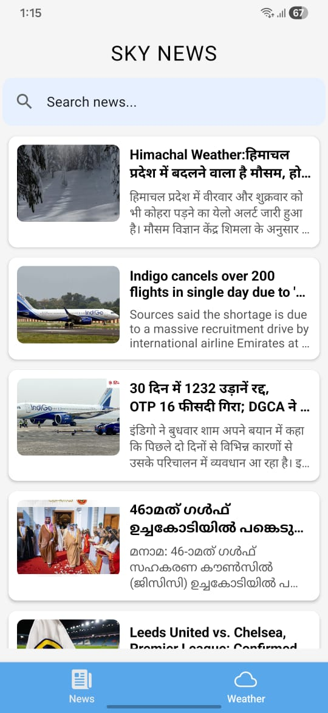
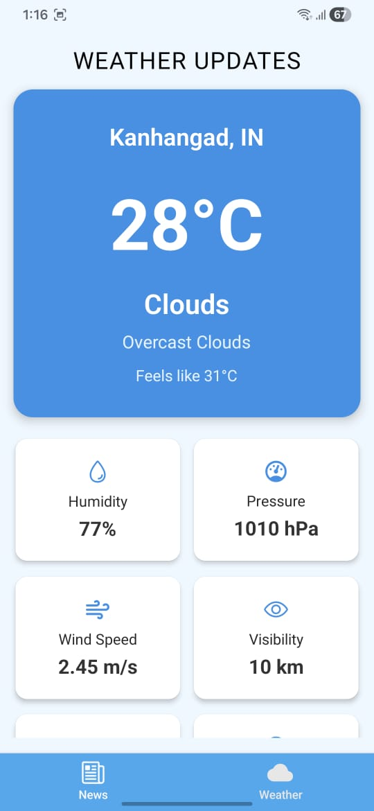

# SkyNews - News & Weather App

A simple mobile app that shows news and weather information using React Native and Expo.

## Setup Instructions

### 1. Install Dependencies
```bash
npm install
```

### 2. Start the App
```bash
npx expo start
```

### 3. Run on Device
- Scan the QR code with Expo Go app (iOS/Android)
- Or press `a` for Android emulator
- Or press `i` for iOS simulator

## API Key Configuration

This app needs two API keys to work:

### News API Key
1. Go to [NewsAPI.org](https://newsapi.org/)
2. Sign up for a free account
3. Copy your API key
4. Add it to `.env` file as `EXPO_PUBLIC_NEWS_API_KEY=your_key_here`

### Weather API Key
1. Go to [OpenWeatherMap](https://openweathermap.org/api)
2. Sign up for a free account
3. Copy your API key
4. Add it to `.env` file as `EXPO_PUBLIC_WEATHER_API_KEY=your_key_here`

### Example .env file:
```
EXPO_PUBLIC_NEWS_API_KEY=your_news_api_key_here
EXPO_PUBLIC_WEATHER_API_KEY=your_weather_api_key_here
```

## Design Decisions

### Why I Built This App
- **Simple Navigation**: Used tabs at the bottom so users can easily switch between news and weather
- **Real Location**: App asks for your location to show local weather and news
- **Clean Design**: Used simple cards and lists to make information easy to read
- **Fast Loading**: Added loading screens so users know the app is working

### Technology Choices
- **React Native + Expo**: Easy to build and test on both iPhone and Android
- **Axios**: Simple way to get data from APIs
- **React Native Paper**: Pre-made components that look good
- **Expo Location**: Gets user's location for local weather

### App Structure
- `app/` - Main screens (Home, Weather)
- `src/components/` - Reusable parts like news cards and weather cards
- `src/services/` - Code that talks to APIs

## Screenshots

### Home Screen (News)


*Shows latest news articles with images and headlines*

### Weather Screen


*Shows current weather and forecast for your location*

## Features

- 📰 Latest news articles
- 🌤️ Current weather conditions
- 📍 Location-based content
- 🔍 Search functionality
- 📱 Works on iOS and Android

## How It Works

1. **News Tab**: Gets news from NewsAPI and shows them in a list
2. **Weather Tab**: Uses your location to get weather from OpenWeatherMap
3. **Search**: You can search for specific news topics
4. **Details**: Tap any news article to read more

## Troubleshooting

**App won't start?**
- Make sure you ran `npm install`
- Check that your API keys are in the `.env` file

**No news showing?**
- Check your internet connection
- Make sure your News API key is correct

**No weather data?**
- Allow location permissions when asked
- Check your Weather API key is correct

## Built With

- React Native
- Expo
- NewsAPI
- OpenWeatherMap API
- React Native Paper